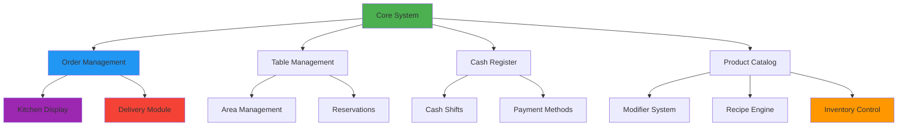

# Roadmap de Desarrollo - Sistema Gastronómico Modular (PentiumPOS)

**Proyecto:** Control Gastronómico V2  
**Fecha de Actualización:** 14 Enero 2026  
**Stack Tecnológico:**

- **Backend:** Node.js + Express, Prisma ORM, MySQL (Architecture: Modular Monolith)
- **Frontend:** React, TailwindCSS, Shadcn/UI, Zustand  
  **Filosofía:** Arquitectura Modular Desactivable mediante Feature Flags

---

## 📋 Tabla de Contenidos

1. [Visión General del Proyecto](#visión-general-del-proyecto)
2. [Estado Actual del Proyecto](#estado-actual-del-proyecto)
3. [Sprints de Backend](#sprints-de-backend)
4. [Sprints de Frontend](#sprints-de-frontend)
5. [Plan de Verificación y Testing](#plan-de-verificación-y-testing)
6. [Cronograma General](#cronograma-general)

---

## Estado Actual del Proyecto

> **Última Actualización: 15/01/2026**

### ✅ Completado

- **Sprint 0: Infrastructure** (Setup, Prisma Schema, DB).
- **Sprint 1: Auth & RBAC** (Backend + Frontend, Login, Roles, Rate Limiting).
- **Sprint 2: Menu System** (Backend + Frontend, Categorías, Productos, Recetas en Backend).
- **Sprint 3: Inventory (Backend)** (Ingredientes, StockMovements).
- **Sprint 4: Orders (Backend)** (Servicio de Órdenes, Integración Stock, Pagos).
- **Sprint 5: Finance/Caja (Backend)** (CashShift, Arqueo Ciego, businessDate).
- **Sprint 5: Tables (Backend/Frontend)** (Gestión de salón, Drag & Drop, batch updates).
- **Sprint 8: KDS (Backend/Frontend)** (Cocina, WebSocket, Kanban).
- **Sprint F3: POS Interface** (Layout, Grid, Carrito, Modal Pago, Integración Backend).
- **Sprint F4: Caja (Frontend)** (OpenShiftModal, CloseShiftModal con Arqueo Ciego).
- **Technical Debt:** Type Safety Audit & Fix (28+ `as any` eliminados).
- **Sprint: Modifiers UI:** Interfaz de selección en POS y visualización en KDS.

### 🚧 En Progreso

- **Sprint: Printing:** Integración con impresoras térmicas.

---

## Visión General del Proyecto

### Propósito

Desarrollar un **Sistema POS Gastronómico Híbrido** que pueda escalar desde un food truck hasta un restaurante de múltiples pisos, mediante la activación/desactivación de módulos según las necesidades del negocio.

### Ventajas Competitivas

Basado en el análisis de [COMPARATIVAS.md](file:///d:/Proyectos/control_gastronomicoV2/docs/COMPARATIVAS.md):

| Competidor           | Fortaleza a Adoptar                       | Nuestra Diferenciación                |
| :------------------- | :---------------------------------------- | :------------------------------------ |
| **Maxirest**         | Modo Offline + Auditoría robusta          | Arquitectura moderna con mejor UX     |
| **Woki / Nocueloit** | Integraciones delivery + QR Self-ordering | Sistema modular más flexible          |
| **Citynet**          | Nicho local                               | Arquitectura desactivable por módulos |

### Módulos del Sistema



---

## Análisis del Schema y Arquitectura

### Modelo de Datos (Prisma Schema)

El schema proporcionado define **20+ modelos** organizados en los siguientes dominios:

#### **1. Configuración y Seguridad** [IMPLEMENTADO]

- `TenantConfig` - Feature flags del sistema
- `Role` - Roles con permisos en JSON
- `User` - Usuarios con PIN y contraseña

#### **2. Catálogo de Productos** [IMPLEMENTADO]

- `Category` + `Printer` - Categorías con enrutamiento de impresión
- `Product` - Productos con soporte para SIMPLE/COMBO/RECIPE
- `ModifierGroup` + `ModifierOption` - Sistema de modificadores anidados
- `Ingredient` + `ProductIngredient` - Gestión de recetas

#### **3. Gestión de Inventario** [BACKEND IMPLEMENTADO]

- `Ingredient` - Con stock y costo
- `StockMovement` - Auditoría de movimientos (PURCHASE/SALE/WASTE/ADJUSTMENT)

#### **4. Órdenes y Mesas** [PARTIALMENTE IMPLEMENTADO]

- `Order` - Con soporte multi-canal (POS/WAITER_APP/QR_MENU/DELIVERY_APP) **(Backend Listo)**
- `OrderItem` + `OrderItemModifier` - Items con modificadores aplicados
- `Table` + `Area` - Gestión de salón con coordenadas X/Y

#### **5. Clientes y Delivery** [PENDIENTE]

- `Client` - Con programa de puntos y wallet
- Órdenes con soporte para delivery tracking

#### **6. Caja y Pagos** [BACKEND EN PROGRESO]

- `CashShift` - Turnos de caja
- `Payment` - Pagos vinculados a órdenes y turnos **(Modelo Listo)**

### Arquitectura de Carpetas

```
/backend                    # API Node.js + Express
  /src
    /config               # Configuración de DB, env, etc.
    /controllers          # Request handlers
    /services             # Lógica de negocio
    /routes               # Definición de rutas
    /middleware           # Auth, validation, error handling
    /utils                # Helpers y utilidades
  /prisma                 # Schema y migraciones
  package.json

/frontend                   # React SPA
  /src
    /components           # Componentes reutilizables
    /pages                # Páginas principales
    /modules              # Lógica por dominio
      /core
        /auth             # AuthProvider, hooks, stores
        /config           # TenantConfig management
        /ui               # Shared UI components
      /menu
        /categories       # CRUD categorías
      /products         # CRUD productos
      /orders
        /pos              # POS interface
        /cart             # Carrito (Zustand store)
        /tables           # Gestión de mesas
      /kitchen
        /kds              # Kitchen Display System
      /inventory
        /ingredients      # Gestión de ingredientes
      /finance
        /cash-shifts      # Turnos de caja
        /reports          # Reportes
      /delivery
        /clients          # Gestión de clientes
    /stores               # Zustand stores globales
    /hooks                # Custom hooks
    /api                  # Axios/fetch wrappers
  package.json
```

---

## Sprints de Backend

> ⚠️ **FUENTE DE VERDAD TÁCTICA:**
> Para el detalle granular de tareas, endpoints, tareas y checklists de cada sprint, consultar:
> 👉 **[BACKEND_SPRINTS.md](file:///d:/Proyectos/control_gastronomicoV2/backend/DOCS/BACKEND_SPRINTS.md)**

### Resumen de Fases Backend

1.  **Sprint 0: Foundation & Infrastructure** - Setup inicial, Prisma, estructura base. (✅ Completado)
2.  **Sprint 1: Core Auth & RBAC** - Usuarios, Roles, JWT, Middleware de permisos. (✅ Completado)
3.  **Sprint 2: Menu System** - Categorías, Productos, Modificadores, Recetas. (✅ Completado)
4.  **Sprint 3: Inventory (Stock)** - Ingredientes, Movimientos, Auditoría. (✅ Completado)
5.  **Sprint 4: Orders Core** - Sistema de órdenes multi-canal y pagos. (✅ Completado)
6.  **Sprint 5: Tables** - Gestión de salón y asignación.
7.  **Sprint 6: Cash Register** - Turnos de caja, arqueos ciegos.
8.  **Sprint 7: Delivery Core** - Clientes y tracking.
9.  **Sprint 8: KDS Backend** - Enrutamiento a cocina y estados.
10. **Sprint 9: Analytics** - Reportes y métricas.
11. **Sprint 10: Integrations** - Webhooks de Apps de Delivery.

---

## Sprints de Frontend

> ⚠️ **FUENTE DE VERDAD TÁCTICA:**
> Para el detalle granular de componentes, pantallas y tareas de UI de cada sprint, consultar:
> 👉 **[FRONTEND_SPRINTS.md](file:///d:/Proyectos/control_gastronomicoV2/frontend/DOCS/FRONTEND_SPRINTS.md)**

### Resumen de Fases Frontend

1.  **Sprint F0: UI Foundation** - Setup Tailwind, Shadcn/UI, Layouts. (✅ Completado)
2.  **Sprint F1: Authentication UI** - Login, PIN pad, User Management. (✅ Completado)
3.  **Sprint F2: Admin Catalog** - ABM de Productos y Modificadores. (✅ Completado)
4.  **Sprint F3: POS Interface** - **(CRÍTICO)** Interfaz de venta rápida. (✅ UI Completada - Pendiente Integración)
5.  **Sprint F4: Tables UI** - Mapa de salón drag & drop.
6.  **Sprint F5: KDS UI** - Pantalla de cocina.
7.  **Sprint F6: Inventory UI** - Alertas de stock y movimientos.
8.  **Sprint F7: Cash Register UI** - Apertura/Cierre de caja.
9.  **Sprint F8: Delivery UI** - Dashboard de envíos.
10. **Sprint F9: Reports UI** - Gráficos y estadísticas.
11. **Sprint F10: Settings** - Configuración de Tenant y Feature Flags.

---

## Plan de Verificación y Testing

### Testing Automatizado

#### Unit Tests (Backend)

**Herramienta:** Jest + Supertest

**Módulos Críticos:**

- `authService` - Login, JWT generation, role validation
- `orderService` - Cálculo de totales, validación de modificadores
- `inventoryService` - Descuento de stock, movimientos
- `cashShiftService` - Cálculo de arqueos

**Coverage mínimo:** 80% en servicios críticos

```bash
# Comando
npm run test:unit
```

#### Integration Tests (Backend)

**Flujos Completos:**

1. Login → Crear orden → Checkout → Cerrar caja
2. Crear producto con receta → Vender → Verificar descuento de stock
3. Abrir mesa → Agregar items → Split bill → Cerrar
4. Recibir orden de delivery app → Procesar → Actualizar estado

```bash
npm run test:integration
```

#### E2E Tests (Frontend)

**Herramienta:** Playwright o Cypress

**Escenarios:**

1. Usuario hace login → abre POS → agrega productos → checkout
2. Mesero abre mesa → agrega orden → transfiere a otra mesa → cierra
3. Admin crea producto con modificadores → visualiza en POS → orden con modificadores
4. Cocina recibe orden en KDS → marca como ready → actualiza estado

```bash
npm run test:e2e
```

### Testing Manual

#### Checklist de Smoke Tests

**Auth:**

- [x] Login con credenciales correctas
- [x] Login con credenciales incorrectas (debe fallar)
- [x] Login con PIN
- [x] Acceso denegado a ruta protegida sin token

**POS:**

- [ ] Agregar producto sin modificadores
- [ ] Agregar producto con modificadores
- [ ] Validar min/max selection de modificadores
- [ ] Checkout exitoso
- [ ] Checkout con pago dividido

**Tables:**

- [ ] Abrir mesa
- [ ] Agregar items a mesa abierta
- [ ] Transferir orden entre mesas
- [ ] Split bill
- [ ] Cerrar mesa

**Inventory:**

- [x] Vender producto con receta → verificar descuento de stock (Verificado en Backend)
- [ ] Registrar compra de ingrediente
- [ ] Verificar alerta de stock bajo
- [ ] Registro de merma

**Cash Register:**

- [ ] Abrir turno
- [ ] Realizar ventas
- [ ] Registrar movimiento de caja
- [ ] Cerrar turno con arqueo ciego
- [ ] Verificar cálculo de diferencia

---

## Cronograma General

### Timeline de 16 Semanas (4 Meses)

```mermaid
gantt
    title Roadmap de Desarrollo - PentiumPOS
    dateFormat YYYY-MM-DD

    section Infrastructure
    Sprint 0: Foundation              :active, s0, 2026-01-20, 7d

    section Backend Core
    Sprint 1: Auth & RBAC             :active, s1, after s0, 10d
    Sprint 2: Products & Menu         :active, s2, after s1, 10d
    Sprint 3: Inventory               :active, s3, after s2, 12d
    Sprint 4: Orders Multi-Channel    :active, s4, after s3, 14d
    Sprint 5: Tables                  :s5, after s4, 10d
    Sprint 6: Cash Register           :s6, after s5, 10d
    Sprint 7: Delivery Clients        :s7, after s6, 7d
    Sprint 8: KDS                     :s8, after s7, 10d
    Sprint 9: Reports                 :s9, after s8, 10d
    Sprint 10: Integrations           :s10, after s9, 14d

    section Frontend
    Sprint F0: UI Foundation          :active, f0, 2026-01-27, 7d
    Sprint F1: Auth UI                :active, f1, after f0, 7d
    Sprint F2: Catalog UI             :active, f2, after f1, 10d
    Sprint F3: POS Interface          :active, f3, after f2, 14d
    Sprint F4: Tables UI              :f4, after f3, 10d
    Sprint F5: KDS UI                 :f5, after f4, 10d
    Sprint F6: Inventory UI           :f6, after f5, 10d
    Sprint F7: Cash Register UI       :f7, after f6, 7d
    Sprint F8: Delivery UI            :f8, after f7, 10d
    Sprint F9: Reports UI             :f9, after f8, 10d
    Sprint F10: Admin & Settings      :f10, after f9, 7d

    section Testing & Polish
    Integration Testing               :test1, after s10, 7d
    E2E Testing                       :test2, after f10, 7d
    Performance Optimization          :opt, after test2, 5d
    Beta Testing with Clients         :beta, after opt, 14d
```

### Milestones

| Milestone                | Fecha Objetivo | Criterio de Éxito                                  |
| :----------------------- | :------------- | :------------------------------------------------- |
| **M1: Backend MVP**      | Semana 8       | Auth + Products + Orders + Cash funcionando        |
| **M2: Frontend MVP**     | Semana 12      | POS funcional + Table management                   |
| **M3: Full Feature Set** | Semana 16      | Todos los módulos completados                      |
| **M4: Production Ready** | Semana 18      | Testing completo, 3 clientes beta, 0 bugs críticos |

### Recursos Necesarios

**Desarrollo:**

- 1 Full Stack Developer (tú)
- Tiempo estimado: 4 meses a tiempo completo
- Horas totales: ~640 horas

**Infraestructura:**

- Servidor de desarrollo (local o VPS $5/mes)
- Base de datos MySQL (local o cloud)
- Prisma Studio para debugging
- GitHub para control de versiones

**Testing:**

- 2-3 restaurantes beta partners
- Dispositivos: Desktop, Tablet, Móvil
- Impresora térmica para testing

---

## Recomendaciones Finales

### Prioridades según Contexto

> [!IMPORTANT] > **Si tienes UN cliente esperando:** Prioriza Backend Sprints 1-6 + Frontend F1-F4 (POS + Mesas básico)

> [!TIP] > **Si estás validando producto:** Implementa Backend 1-4 + Frontend F1-F3 (POS sin mesas) para demo rápido

> [!WARNING] > **NO implementes Sprint 10 (Integraciones) hasta tener 5+ clientes.** Es complejo y cada delivery app tiene peculiaridades.

### Feature Flags Strategy

**Implementar desde Sprint 0:**

```typescript
// Ejemplo de uso
const config = await getTenantConfig();

if (!config.enableStock) {
  // No renderizar UI de inventario
  // No validar stock en backend
}

if (!config.enableDelivery) {
  // Ocultar módulo de delivery
}
```

Esto permite vender el sistema a diferentes tipos de negocio:

- **Food Truck:** Solo POS + Caja (todo disabled excepto core)
- **Bar:** POS + Mesas (sin stock, sin delivery)
- **Restaurante completo:** Todo habilitado

### Estrategia de Deploy

**Desarrollo:**

```bash
npm run dev  # Express dev server (nodemon)
```

**Staging:**

```bash
npm run build
npm start
# Usar PM2 para process management
```

**Producción:**

- Docker container con Node.js
- MySQL en servidor separado o managed (PlanetScale, AWS RDS)
- Backups automáticos diarios
- Monitoring con Sentry o similar

---

## Apéndice: Stack Técnico Detallado

### Backend

- **Framework:** Node.js + Express
- **ORM:** Prisma 5+
- **Database:** MySQL 8+
- **Auth:** JWT (jsonwebtoken) + bcrypt
- **Validación:** Zod
- **Real-time:** WebSocket nativo o Socket.IO

### Frontend

- **Framework:** React 18+ (SPA con Vite o CRA)
- **Estado:** Zustand
- **UI:** TailwindCSS + Shadcn/UI
- **Forms:** React Hook Form + Zod
- **Charts:** Recharts o Chart.js
- **Drag & Drop:** dnd-kit

### DevOps

- **Version Control:** Git + GitHub
- **CI/CD:** GitHub Actions
- **Testing:** Jest + Playwright
- **Linting:** ESLint + Prettier
- **Deployment:** Vercel (frontend) + Railway/Render (fullstack)

### Opcional (Fase 2)

- **Cache:** Redis
- **Queue:** BullMQ
- **File Storage:** AWS S3 o Cloudinary
- **Notifications:** Twilio (WhatsApp/SMS)
- **Monitoring:** Sentry, LogRocket

---

**Preparado por:** Antigravity AI
**Fecha:** 14 Enero 2026
**Versión:** 1.0

**Próximos Pasos:**

1. Revisar y aprobar roadmap
2. Configurar repositorio y proyecto base (Sprint 0)
3. Comenzar Sprint 1: Authentication
